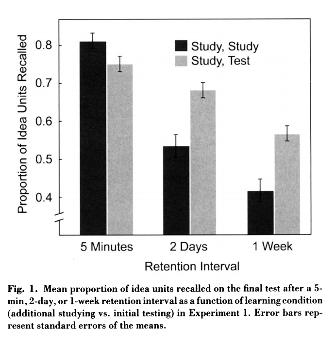

<span class="newthought">
The null hypothesis is never proved or established, but is possibly disproved, in the course of experimentation. Every experiment may be said to exist only to give the facts a chance of disproving the null hypothesis.
---R. A. Fisher
</span>


```{r, echo=FALSE}
hooks = knitr::knit_hooks$get()
hook_foldable = function(type) {
  force(type)
  function(x, options) {
    res = hooks[[type]](x, options)
    
    if (isFALSE(options[[paste0("fold.", type)]])) return(res)
    
    paste0(
      "<details><summary>", type, "</summary>\n\n",
      res,
      "\n\n</details>"
    )
  }
}
knitr::knit_hooks$set(
  output = hook_foldable("output"),
  plot = hook_foldable("plot")
)
```

## Introduction and instructions

Now that we are comfortable with R and the fundamentals of plotting, we can  focus on starting to tackle the core question in data analysis: how do we extract patterns and make sense from large arrays of numbers? From here on, we will thus be focusing on __making sense of data from experiments__.


Our goal as scientists is to do experiments to ask a question about whether one thing causes change (influences) another thing. Then, we look at the data to help us answer that question. In general, we expect to find a difference in our measurement between the different conditions of the experimental manipulation. We expect to find a difference when the manipulation works, and causes change in our measure. We expect not to find a difference when the manipulation does not work, and does not cause change.

However, things are generally not that easy. Experimental manipulations are not the only thing that can cause change in our measures. Chance alone can cause change, since our measures are usually variable themselves. It is also generally very hard to reproduce experimental settings that would be identical but for the condition that you are testing, and you would have to adjust for the difference before concluding whether or not there is a difference between a given group and the next. For instance, you could have unwanted variability in the experimental setting if you find yourself using a different machine for one group and the other, thus causing an -- unwanted -- difference between treatment and control.

At a minimum, when we conduct an experiment, we want to know **if the change we observed is bigger than the change that can be produced by chance**. Theoretically, random chance could produce most any change we might measure in our experiment. So, there will always be uncertainty about whether our manipulation caused the change, or chance caused the change. But, we can reduce and evaluate that uncertainty. When we do this, we make **inferences** about what caused change in our experiments. This process is called **statistical inference**. We use **inferential statistics** as tools to help us make these inferences. 

In this lab, we introduce you to foundational concepts in **statistical inference**. This is also commonly termed **hypothesis testing**. But, for various reasons using that language to describe the process is tied to particular philosophies about doing statistical inference. We use some of that language here, so that you know what it means. But, we also use our own plain language, so you know what the point is, without the statistical jargon.

In this lab, we will work through a few different statistical tests for building your conceptual understanding for statistical inference. We will show you how to conduct these tests in R on fake data, and real data.


__Your assignment  before the discussion:__

- Begin by watching these videos on hypothesis testing:

    - [Null Hypothesis](https://crumplab.github.io/statistics/foundations-for-inference.html#videos-3)
    - [Types of Errors](https://crumplab.github.io/statistics/foundations-for-inference.html#types-of-errors).

- Once you're done, work through the following lab. Code up the questions as they come along and look at the answers only whenyou have spent a little bit of time searching for the solution.

## Part I: Understanding the theory

###  1. Brief review of Experiments

Experiments are a structured way of collecting data that can permit inferences about causality. If we wanted to know whether something like watching cats on YouTube increases happiness we would need an experiment. We already found out that just finding a group of people and measuring number of hours watching cats, and level of happiness, and correlating the two will not permit inferences about causation. For one, the causal flow could be reversed. Maybe being happy causes people to watch more cat videos. We need an experiment.

An experiment has two parts. A manipulation and a measurement. The manipulation is under the control of the experimenter. Manipulations are also called independent variables. For example, we could manipulate how many cat videos people will watch, 1 hour versus 2 hours of cat videos. The measurement is the data that is collected. We could measure how happy people are after watching cat videos on a scale from 1 to 100. Measurements are also called dependent variables. So, in a basic experiment like the one above, we take measurements of happiness from people in one of two experimental conditions defined by the independent variable. Let’s say we ran 50 subjects. 25 subjects would be randomly assigned to watch 1 hour of cat videos, and the other 25 subjects would be randomly assigned to watch 2 hours of cat videos. We would measure happiness for each subject at the end of the videos. Then we could look at the data. What would we want to look at? Well, if watching cat videos cause change in happiness, then we would expect the measures of happiness for people watching 1 hour of cat videos to be different from the measures of happiness for people watching 2 hours of cat videos. If watching cat videos does not change happiness, then we would expect no differences in measures of happiness between conditions. Causal forces cause change, and the experiment is set up to detect the change.

Now we can state one overarching question: "how do we know if the data changed between conditions?" If we can be confident that there was a change between conditions, we can infer that our manipulation caused a changed in the measurement. If we cannot be confident there was a change, then we cannot infer that our manipulation caused a change in the measurement. We need to build some change detection tools so we can know a change when we find one.

“Hold on, if we are just looking for a change, wouldn’t that be easy to see by looking at the numbers and seeing if they are different, what’s so hard about that?”. Good question. Now we must take a detour. The short answer is that there will always be change in the data since our measurements are inherently variable: we need to find an appropriate "scale" to compare how big that change is to the effects of chance alone.

### 2. The inherent randomness of the data


Over the last few weeks, we discussed samples and distributions, and the idea that you can take samples from distributions. So, from now on when you see a bunch of numbers, you should wonder, "where did these numbers come from?". What caused some kinds of numbers to happen more than other kinds of numbers. The answer to this question requires us to again veer off into the abstract world of distributions. A distribution is a place where numbers can come from. The distribution sets the constraints. It determines what numbers are likely to occur, and what numbers are not likely to occur. Distributions are abstract ideas. But, they can be made concrete, and we can draw them with pictures that you have seen already, called histograms.

The next bit might seem slightly repetitive from our labs on probability. We again look at sampling numbers from a gaussian distribution. We show that individual samples can look quite different from each other. Much of the beginning part of this lab will already be familiar to you, but we take the concepts in a slightly different direction. The direction is how to make inferences about the role of chance in your experiment.

### 3. Building up intuition


In this first part, you will find out what kind of differences between two conditions can be found by chance alone. This shows you what chance can do. Then, you will compare what you actually found in one experiment, with the chance distribution, and make an inference about whether or not chance could have produced the difference.

#### Make assumptions about the distribution for your measurement

The first step in conducting the test is to make a guess at the distribution behind your measurement. We will see in the next part how to do this from real data. For now, we just pick a distribution. For example, let's say we are measuring something that comes from a normal distribution with mean = 75 and standard deviation = 5. Perhaps, this is a distribution for how people perform on a particular test. The mean on the test is 75%, with a standard deviation of 5%. We know from last lab that 3 standard deviations away from the mean is pretty unlikely with this distribution. So, for example, most people never score above 90% (5*3=15, 75+15 = 90) on this test.

In this example situation, we might imagine an experiment that was conducted to determine whether intervention A (a new textbook for instance, or a new teaching philosophy) improves test performance, compared to a control condition where no manipulation took place. Using the test, we can simulate differences that can occur by chance. We are formally simulating the differences that could be obtained between two control conditions, where no manipulation took place.

To, restate our assumptions, we assume a single score for each subject is sampled from:

`rnorm(n, mean=75, sd=5)`

#### Make assumptions about N

In the real world, experiments have some number of subjects in each condition, this number is called N. For our simulation we, need to choose the number of subjects that we have. For this demonstration, we choose N = 20 in each condition. 

#### Choose the number of simulations to run

You are now going to run a fake experiment with no manipulation, and do this many times over (doing it many times over is called **monte carlo simulation**). Each time you will do this:

1. Sample 20 numbers for control group A using `rnorm(20, mean=75, sd=5)`
2. Sample 20 numbers for control group B using `rnorm(20, mean=75, sd=5)`
3. Compute the means for control group A and B
4. Compute the difference between the mean for group A and B
5. Save the differences score in a variable
6. Repeat as many times as we want

If we repeat the simulation 100 times, we will see the differences that can be produced by chance, when given the opportunity 100 times. For example, in a simulation like this, the biggest difference (the maximum value) only happens once. We can find that difference, and then roughly conclude that a difference of that big happens 1 out of 100 times just by chance. That's not a lot. 

If we want to be more restrictive, we can make the simulation go to 1,000, or 10,000, or greater. Each time the maximum value will tell us what is the biggest thing chance did 1 out of 1000 times, or 1 out of 10,000 times. 

Let's use 10,000 times here.

#### Run the simulation

Code the Monte Carlo simulation described above. Plot the histogram of the differences between groups A and B obtained by chance alone.

Click on the arrow to check your answer.

```{r, cache=TRUE}
library(ggplot2)
# set paramaters of simulation
sims_to_run <- 10000
sample_n   <- 20
dist_mean  <- 75
dist_sd    <- 5
# run simulation
mean_differences <- length(sims_to_run)
for(i in 1:sims_to_run){
  mean_control_A      <- mean(rnorm(sample_n, dist_mean, dist_sd))
  mean_control_B      <- mean(rnorm(sample_n, dist_mean, dist_sd))
  mean_differences[i] <- mean_control_A - mean_control_B
}
# plot the  distribution of mean difference scores
plot_df <- data.frame(sim=1:sims_to_run,mean_differences)
ggplot(plot_df,aes(x=mean_differences))+
  geom_histogram(bins=20, color="white")+
  theme_classic()+
  ggtitle("Histogram of mean differences between two samples (n=20) \n
          both drawn from the same normal distribution (u=75, sd=5")+
  xlab("mean difference")
```


#### Find the range

We can see that chance produces some differences that are non-zero. The histogram shows all the mean differences that were produced by chance. Most of the differences are between -2 and +2, but some of them are bit more negative, or a bit more positive. If we want to know what chance **did** do in this one simulation with 10,000 runs, then we need to find the range, the minimum and maximum value. This will tell us the most negative mean difference that chance did produce, and the most positive mean difference that chance did produce. Then, we will also know that chance **did not** produce any larger negative, or larger positive differences, in this simulation.

We use the `min()` and `max()` functions to get the minimum and maximum value.

```{r}
min(mean_differences)
max(mean_differences)
```

We now know, that biggest negative difference was `r round(min(mean_differences), digits=3)`, and the biggest positive difference was `r round(max(mean_differences), digits=3)`. We also know that any mean difference inside the range **was produced by chance** in our simulation, and any mean difference outside the range **was not produced by chance** in our simulation

#### Make inferences 

This part requires you to think about the answers --- but no new simulations are needed. Let's go through some scenarios.

1. Suppose you sample 20 numbers from a normal distribution with mean = 75, and standard deviation =5, like you did above. The mean of your sample is 76. Then, you take another sample of the same size, from the same distribution, and the mean of your second sample is 77. The mean difference is +1 (or -1, depending on how you take the difference)

     **Question**: According to the histogram you previously plotted, is a mean difference of 1 or -1 likely to occur by chance? How frequent is a mean difference of at least one observed?

<details>
  <summary>Click to see the answer!</summary>
  
**Answer**: Yes, it is inside the range of observed values--- in roughly 50 \% of cases, the difference in means is at least 1.
```{r}
mean(abs(mean_differences)>1)

```
</details>
    
2. Same as above, but the mean of your first sample is 74, and the mean of your second sample is 80, showing a mean difference of 6, or -6.

    **Question**: According to the histogram did a mean difference of 6 or -6 occur by chance?
    
<details>
  <summary>Click to see the answer!</summary>
  
    **Answer**: No, it is outside the range: it never happened in any of our 1,000 simulations. It is thus a very low, unlikely event.

```{r}
mean(abs(mean_differences)>6)
```
</details>
    
3. Let's see how these simulations would translate in an actual setting. You run an experiment. Group A receives additional instruction that should make them do better on a test. Group B takes the test, but without the instruction. There are 20 people in each group. You have a pretty good idea that group B's test scores will be coming from a normal distribution with mean = 75, and standard deviation = 5. You know this because you have given the test many times, and this is what the distribution usually looks like. You are making an educated guess. You find that the mean test performance for Group A (with additional instruction) was 76%, and the mean test performance for Group B (no additional instruction) was 75%. The mean difference has an absolute value of +1.

   **Question #1**: According to the histogram, could chance alone have produced a mean absolute difference of +1?
   
<details>
  <summary>Click to see the answer!</summary>
  
  **Answer**: Yes, it is inside the range, a previously shown.
    </details>
    
   **Question #2**: It looks like Group A did better on the test (on average), by 1%, compared to the control group B. Are you willing to believe that your additional instruction **caused the increase in test performance**?
   
   <details>
  <summary>Click to see the answer!</summary>
  
   **Answer**: The answer is up to you. There is no correct answer. It could easily be the case that your additional instruction did not do anything at all, and that the difference in mean test performance was produced by chance. My inference is that I do not know if my instruction did anything, I can't tell it's potential influence from chance.
    </details>
    
4. Same as 3, except the group mean for A (receiving instruction) is 90%. The group mean for B (no instruction control) is 75%. The absolute mean difference is 15%.

   **Question #1**: According to the histogram, could chance alone have produced a mean absolute difference of +15?

<details>
  <summary>Click to see the answer!</summary>
  
  **Answer**: No, it is well outside the range, a zero-probability event according to our experiments.
  </details>
    
**Question #2**: It looks like Group A did better on the test (on average), by 15%, compared to the control group B. Are you willing to believe that your additional instruction **caused the increase in test performance**?
<details>
  <summary>Click to see the answer!</summary>
  
**Answer**:  The answer is up to you. There is no correct answer. You know from the simulation that chance never produced a difference this big, and that producing a difference this big by chance would be like winning the lottery (almost never happens to you). My inference is that I believe chance did not produce the difference, because that event has an almost zero probability of happening by chance alone.
    </details>
    
    
#### Planning your experiment

We've been talking about a hypothetical experiment where an instructor tests whether group A does better (when receiving additional instruction) on a test, compared to a group that does receives no additional instruction and just takes the test.

If this hypothetical instructor wanted to make an experiment, they would get to choose things like how many subjects they will put in each condition. How many subjects should they plan to get?

**The number of subjects they plan to get will change what chance can do, and will change the sensitivity of their experiment to detect differences of various sizes, that are not due to chance**.

We can use the simulation process to make informed decisions about how many subjects to recruit for an experiment. This is called **sample-size planning**. There are two goals here. The instructor might have a first goal in mind. They may be only interested in adopting a new method for instruction, if it actually improves test performance beyond more than 1% (compared to control). Differences of less than 1% are just not worth it for the instructor. They want bigger differences, they want to help their students improve more than 1%. 

One problem for the instructor, is that they just don't know in advance how good their new teaching materials will be. Some of them will be good and produce bigger differences, and some of them won't. The size of the difference from the manipulation can be unknown. However, this doesn't really matter for planning the experiment. The instructor wants to know that they can **find** or detect any real difference (not due to chance) that is say 2% or bigger. We can use the simulation to figure out roughly (or more exactly, depending on how much we work at it) how many subjects are needed to detect difference of at least 2%.

Notice, from our prior simulation, chance does produce differences of 2% some of the time (given 1,000 runs). The task now is to re-run the simulation, but use different numbers of subjects to figure out how many subjects are needed to always detect differences of 2%. To be simple about this, we are interested in producing a distribution of mean differences __that never produces a mean difference of -2% to + 2% (not once out of 1000 times)__. This way, we'll be able to differentiate between an actual effect, and chance alone. You can re-run this code, and change N until the min and max are always smaller than -2 to +2.

The code starts out exactly as it was before. You should change the number for `sample_n`. As you make the number bigger, the range (min and max) of the mean differences by chance will get smaller and smaller. Eventually it will be smaller than -2 to +2. When you get it this small, then the N that you used is your answer. Use that many subjects. If you run your experiment with that many subjects, **AND** you find a difference or 2 or greater, then you know that chance does not do this even 1 times out of 1000. 


```{r}
library(ggplot2)
# set paramaters of simulation
sims_to_run <- 1000
sample_n   <- 20
dist_mean  <- 75
dist_sd    <- 5
# run simulation
mean_differences <- length(sims_to_run)
for(i in 1:sims_to_run){
  mean_control_A      <- mean(rnorm(sample_n, dist_mean, dist_sd))
  mean_control_B      <- mean(rnorm(sample_n, dist_mean, dist_sd))
  mean_differences[i] <- mean_control_A - mean_control_B
}
# plot the  distribution of mean difference scores
plot_df <- data.frame(sim=1:sims_to_run,mean_differences)
ggplot(plot_df,aes(x=mean_differences))+
  geom_histogram(bins=20, color="white")+
  theme_classic()+
  ggtitle("Histogram of mean differences between two samples (n=20) \n
          both drawn from the same normal distribution (u=75, sd=5")+
  xlab("mean difference")
min(mean_differences)
max(mean_differences)
```

## Part II: an example on real data

In this example we look at how you can run a statistical inference test to evaluate the results in a published paper. The goal of this is to build up your intuitions about whether or not an observed difference could have been caused by chance. We take many liberties, and this is not an exact test of anything. However, we will see how a series of rough, and reasonable assumptions can be made to simulate the results of published experiments, even when exact information is not provided in the paper.

#### Test-enhanced learning

We have already been using an educational example. We've been talking about a manipulation that might be employed to help students learn something better than they otherwise would without the manipulation.

Research in Cognitive Psychology has discovered clear evidence of some teaching practices that really work to enhance memory and comprehension. One of these practices is called test-enhanced learning. Students who study material, and take a quick test (quiz) while they study, do better at remembering the material compared to students who just studied the whole time and did not take a quiz.

Here is a link to a [paper demonstrating the test-enhanced learning effect](https://www.jstor.org/stable/pdf/40064526.pdf?casa_token=jMQnevvTRoIAAAAA:J96DQ0EHWCDKvjV3D-OdQ7TFnJ_DTZEz_G6zG1YMstqGu7fuzjzM0V4PiNREvB1sfLxTXn68FpHhoIUFpOx9p5fjsB7hcqQTUCQix9jxdj_hx-zqoZ8).

The citation is: Roediger III, H. L., & Karpicke, J. D. (2006). Test-enhanced learning: Taking memory tests improves long-term retention. Psychological science, 17(3), 249-255.

### Brief summary

The subjects learned about some things in two conditions. In one condition (study-study) they studied some things, then studied them again. In the other condition (study-test) they studied some things, then took a quiz about the things rather then studying them one more time.

Everyone received follow up tests to see what they learned and remembered. They came back one week later and took the test. The researchers measured the mean proportion of things remembered in both conditions. They found the study-test condition had a higher mean proportion of remembered idea units than the study-study condition. So, the difference between the mean proportions suggest that taking a quick test after studying was beneficial for remembering the content. The researchers also conducted statistical tests, and they concluded the difference they found was not likely due to chance. Let's see if we come to the same conclusion about the role of chance.


### Modeling assumption: Estimate the paramaters of the distribution

The first ingredient in statistical inference is to find an appropriate distribution to model the data.
We thus need to make assumptions about where the sample data is coming from. Let's consider figure 1 from the paper.
```{r, fold.plot=FALSE, echo=FALSE, out.width='50%'}

```

We will estimate our distribution by looking at this figure. We will be doing **informed guesstimation** if you will (a word made-up by the primary author of this lab, Matthew Crump).

Look only at the two bars for the `1 week` condition. 

The mean for the study-study group is about .4. The mean for the study-test group is about .55. The results section reports that the actual mean for the study-study group was .42 (42%) and the mean for the study-test group was .56 (56%). Pretty close to our visual guesstimate.

The data show that the study-test group remembered .14 (14%, or .56-.42=.14) more idea units than the study-study group. 

**Estimating the mean**

We can imagine for the moment that this difference could have been caused by chance. For example, in this case, both samples would have been drawn from the same distribution. For example, we might say that on average people remember about .49 idea units after a one week delay. I got .49 by averaging the .42 and the .56 together. We can use this as the mean for our distribution in our simulation-based test. 

**N**

The paper says there were 120 subjects in total, and that different groups of subjects were measured in the three different delay conditions (5 minutes, 2 Days and 1 week). We will assume there were an equal number of subjects in each group. There were 3 groups, 120/3 = 40, so we assume there were 40 subjects in the 1 week delay group

**Estimating Standard Deviation**

The paper doesn't directly report the standard deviation for the measurement of proportion idea units. But, we can guesstimate it visually. Look at the little bars with a line on them coming out of each bar. These are called error bars, and they represent the standard error of the mean. 

These look like they are about .033 in length. We know the standard error of the mean (SEM) is the standard deviation divided by the sqare root of N. So, we can infer that the standard deviation is $.033 * \sqrt{40} = .21$.

The paper also reports cohen's D, which is a measure of effect size using the mean difference divided the standard deviation. Cohen's D was .83, so the standard deviation must have been $.14/.83 = .168$, which is pretty close to our guesstimate of .21.

### Findings from the original study

One week after the initial learning conditions, subjects came back and took a retention test to see how much they learned. The mean proportion "idea units" recalled was:

1. study-study : 42% or .42
2. study-test : 56% or .56

The mean difference was .56-.42 = .14 or a whopping 14% improvements. That's actually pretty big.

What we want to know is whether chance could produce a difference of 14%, or .14, just by itself.


### Run the simulation

Now we can plug our numbers in to the simulation.

1. We run the simulation 100 times
2. Our sample N is 40
3. The mean of our distribution is .49
4. The standard deviation of the distribution is .168

What do you conclude?

```{r}
# set paramaters of simulation
sims_to_run <- 100
sample_n   <- 40
dist_mean  <- .49
dist_sd    <- .168
# run simulation
mean_differences <- length(sims_to_run)
for(i in 1:sims_to_run){
  mean_control_A      <- mean(rnorm(sample_n, dist_mean, dist_sd))
  mean_control_B      <- mean(rnorm(sample_n, dist_mean, dist_sd))
  mean_differences[i] <- mean_control_A - mean_control_B
}
# plot the  distribution of mean difference scores
plot_df <- data.frame(sim=1:sims_to_run,mean_differences)
ggplot(plot_df,aes(x=mean_differences))+
  geom_histogram(bins=20, color="white")+
  theme_classic()+
  ggtitle("Histogram of mean differences in proportion remembered")+
  xlab("mean difference")
min(mean_differences)
max(mean_differences)
```

  <details>
  <summary>Click to see the answer!</summary>
  
According to the simulation, the biggest negative difference was `r round(min(mean_differences), digits=3)`, and the biggest positive difference was `r round(max(mean_differences), digits=3)`. We also know that any mean difference inside the range **was produced by chance** in our simulation, and any mean difference outside the range **was not produced by chance** in our simulation.

A difference of .14 or 14% was never produced by chance, it was completely outside the range. Based on this analysis we can be fairly confident that the test-enhanced learning effect was not a fluke, it was not produced by chance. We have evidence to support the claim that testing enhances learning, and because of this we test you while you are learning to enhance your learning while you learn.
 </details>

### Decision criteria and p-values

What hypothesis testing quantifies is thus a probability: it is the probability to observe a statistic (here, the difference in means) as extreme (or big) as we do under chance alone. This probability is known as the _p-value for your test_. The scenario in which the change between the two groups is due to chance alone is known as __``the null hypothesis``__. Thus, the core ingredient in statistical inference is in defining what chance looks like -- for instance, by making assumptions on the shapes of the distributions, like in the previous section.

So now, you have you p-value as a metric to quantify how "likely" is your event under chance alone. You thus need to specify when that probability is low enough to say that chance is unlikely to have caused the change: this is called "Rejecting the null hypothesis". 

When you are determining whether or not chance could have produced a difference in your data, you might want to consider how stringent you want to be about accepting the possibility that chance did something. For example chance could produce a difference of 0 or greater 100% of the time. Or, it produces a difference of 10 or greater, a very small (less than .00001% of the time). How big does the difference need to be, before you will consider the possibility that chance probably didn't cause the difference.

**Alpha**. Researchers often set what is called an **alpha** criteria. This draws a line in the histogram, and says I will be comfortable assuming that chance did not produce my differences, when chance produces difference less than X percent of the time. This X percent, is the alpha value. For example, it is often set to 5%, or **p <= .05**. 

Where is 5% of the time on our histogram? What mean difference or greater happens less than or equal to 5% of the time?


### Finding the critical region

A related concept (that you can use interchangeably with the p-value) is the notion of a critical region.The critical region corresponds to all the values that your difference in means can take for the null to be rejected.

1. Take the simulated mean difference scores and order them from smallest to largest
2. We have 1000 numbers, ordered from smallest to largest.
3. The number in position 950 is the alpha location. All of the numbers from position 0 to 950, reflect 95% of the numbers. What is left over is 5% of the numbers.
4. Find the alpha cut-off, and plot it on the histogram

```{r}
ordered_differences <- sort(mean_differences) # sort
alpha_cutoff <- ordered_differences[950] # pick 950th number
alpha_cutoff
# add to histogram using vline
ggplot(plot_df,aes(x=mean_differences))+
  geom_histogram(bins=20, color="white")+
  geom_vline(xintercept=alpha_cutoff)+
  theme_classic()+
  ggtitle("Histogram of mean differences")+
  xlab("absolute mean difference")
```

OK, so our alpha criterion or cutoff is located at `r round(alpha_cutoff, digits=2)` on the x-axis. This shows us that mean differences of `r round(alpha_cutoff, digits=2)` or larger happen only 5% of the time by chance. 

You could use this information to make an inference about whether or not chance produced the difference in your experiments.

1. When the mean difference is `r round(alpha_cutoff, digits=2)` or larger, you might conclude that chance did not produce the difference

2. When the mean difference is less than `r round(alpha_cutoff, digits=2)`, you might conclude that chance could have produced the mean difference.

It's up to you to set your alpha criterion. In practice it is often set at p=.05. That is the convention and what is generally accepted as a significance threshold.
But theoretically, it is just a convention, you could be more conservative and set it to p=.01. Or more liberal and set it to p=.1. It's up to you. 


### Devising a test: General Recipe

Think of hypothesis testing as a general recipe to diagnose a dataset. The steps are the same, but the ingredients vary:

Step 1. Choose your test statistic -- that is, the variable that you want to measure (i.e, the difference in means,the absolute value of the difference, etc. ) and write down the null hypothesis.

Step 2. Find a distribution for your statistic under the null ---  that is, figure out what "chance" looks like.

Step 3. Compute the probability of observing a  value ``as extreme as your statistic, or more'' under the null.


### A first example of the recipe: The t-test

By way of example, let's focus on a very common test : the t-test. Watch the following [video here](https://crumplab.github.io/statistics/t-tests.html) on the t-test, and read through the following section.

The t-test was devised by William Gosset (1908), a chemist at **the Guiness brewery**,to select best the yielding varieties of barley. Among its typical applications:

- Comparing population mean to a constant value
- Comparing the means of two populations
- Comparing the slope of a regression line to a constant

#### The one-sample t-test

Commonly, the one-sample t-test is used to estimate the chances that your sample came from a particular population. Specifically, you might want to know whether the mean that you found from your sample, could have come from a particular population having a particular mean.

Indeed, suppose you have observations $X_1, \cdots X_n$ for the treatment group in your experiment. You want to measure the existence of a difference between the two groups $\Delta = \bar{X} -u$, where u is some mean (maybe the population mean, or a value that you fix). The problem is that without some notion of how much inherent variability there is in the data, this difference makes little sense: you need to scale it on the scale of the inherent noise of the data. This is pretty much the idea behind the t-test:
$$t =\frac{\text{measure of effect}}{\text{measure of error}}$$
$$t =\frac{\text{Mean difference}}{\text{standard error}}$$

$$t =\frac{\bar{X}- u}{\text{S}_X}$$
 
where $S_X$ is the standard deviation of the sample. In this case, theory tells us that the behaviour of that statistic under the null follows a $t$-distribution with $N-1$ degrees of freedom and non-centrality parameter equal to 0 (under the null, $\bar{X}-u$ is centered) . The t-distribution has indeed two parameters: the first, called the degrees of freedom, and the second, called the non-centrality parameter (by default 0).

Let's now write this recipe mathematically. The mathematical recipe behind the t-test is as follows:

Step 1. Defining a test-statistic : $T = |\bar{X} - \bar{Y}|$. 

Step 2. Null distribution: Under the null, there is no difference between $\bar{X}$ and $\bar{Y}$ and they are sampled from the same distribution. Now, let's figure out what would be the distribution of our statistic under the null. 

By the central limit theorem:
$\bar{X} - \bar{Y} \sim N(0, 2\frac{\sigma^2}{n})$

The trick is that we do not necessarily know the variance $\sigma^2$. This is where the t-distribution comes in handy. What Gausset proved was the follwoing.

If $X_i \sim \mathcal{N}(\mu, \sigma^2)$, the empirical estimates for mean
and variance are:
$\bar X = \frac{1}{n}\sum_{i = 1}^{n} X_i$ and 
$s^2 = \frac{1}{n - 1}\sum_{i = 1}^n(X_i -\bar X)^2$
Let's replace the $\sigma^2$ by $s^2$ in our statistic, which comes the t-statistic:

$$
T = \frac{\bar X −mu}{s/\sqrt{n}}\sim t_{\nu=n-1}
$$
This statistic is known to be a t distribution with n-1 degrees of freedom.

Step 3. Compute the associated p-value using `pt` for instance. For reference, the t-distribution has the following shape.


```{r, fold.plot=FALSE, echo=FALSE, out.width='50%'}
knitr::include_graphics('./t-statistic.png')
```


## Summary of the important concepts

#### 1. Hypothesis testing can answer questions:

- **Is the measured quantity equal to/higher/lower than a given threshold?**
e.g. is the number of faulty items in an order statistically higher
than the one guaranteed by a manufacturer? 
- **Is there a  difference between two groups or observations**? 
e.g. Do treated patient have a higher survival rate than the untreated ones?
- **Is the level of one quantity related to the value of the other quantity?**
e.g. Is hyperactivity related to eating sugar? Is lung cancer related to smoking?

#### To perform a hypothesis test you need to:

> 1. Define the null and alternative hypotheses.
> 2. Choose level of significance $\alpha$.
> 3. Pick and compute test statistics.
> 4. Compute the p-value.
> 5. Check whether to reject the null hypothesis by comparing p-value to $\alpha$.
> 6. Draw conclusion from the test.

#### Null and alternative hypotheses

**The null hypothesis ($H_0$)**: A statement assumed to be true unless it can be 
shown to be incorrect beyond a reasonable doubt. This is something one usually 
attempts to disprove or discredit. 

**The alternate hypothesis ($H_1$)**: A claim that is contradictory to 
H0 and what we conclude when we reject H0.

H0 and H1 are on purporse set up to be contradictory, so that one **can collect
and examine data to decide if there is enough evidence to reject the null 
hypothesis or not**. 

#### P-value

- p-value is the **probability of obtaining the same or "more extreme" event 
than the one observed, assuming the null hypothesis holds (is true)**.

- A small p-value, typically < 0.05, indicates **strong evidence** against the
null hypothesis; in this case you can reject the null hypothesis.

- A large p-value, > 0.05, indicates **weak evidence** against the null 
hypothesis; in this case, you do NOT reject the null hypothesis.


## Your turn: Complete the following exercises.

Similarly to dataset `mtcars`, the dataset `mpg` from `ggplot` package 
includes data on automobiles. However, `mpg` includes data for newer
cars from year 1999 and 2008. The variables measured for each car is slighly 
different. Here we are interested in the variable, `hwy`, the highway miles per 
gallon.


```{r}
# We create a new culumn with manual/automatic data only
library(tidyverse)
mpg <- mpg %>% 
  mutate(
    transmission = factor(
        gsub("\\((.*)", "", trans), levels = c("auto", "manual"))
  )
mpg
```


### Part 1: One-sample test

a. Subset the `mpg` dataset to inlude only cars from  year 2008.


b. Test whether cars from 2008 have mean the highway miles per gallon, `hwy`, 
equal to 30 mpg.


c. Test whether cars from 2008 with 4 cylinders have mean `hwy` equal to 30 mpg.


### Part 2: Two-sample test

a. Test if the mean `hwy` for automatic is **less than** that for manual cars
**in 2008**. Generate a boxplot with jittered points for `hwy` for each 
transmission group.


b. Test if the mean `hwy` for cars from 1999 and is greater than that for
cars from 2008. Generate a boxplot with jittered points
for `hwy` for each year group.


__Acknowledgedments__:

This lab was:

- based on the material of the book and lab provided by the Crump lab [https://crumplab.github.io/]

- prepared with additional information from  Lan Nguyen's course.


